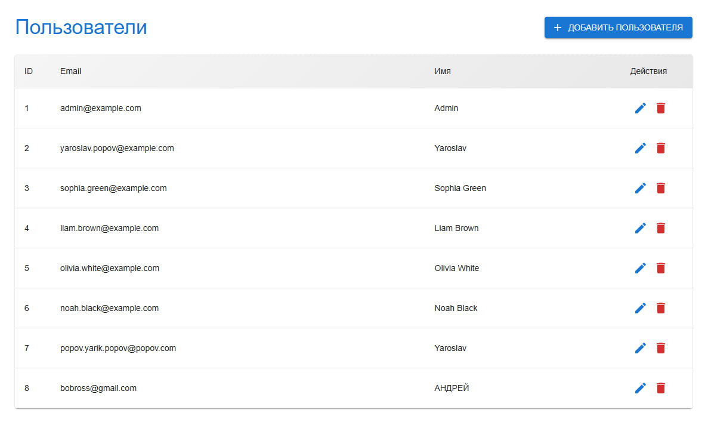
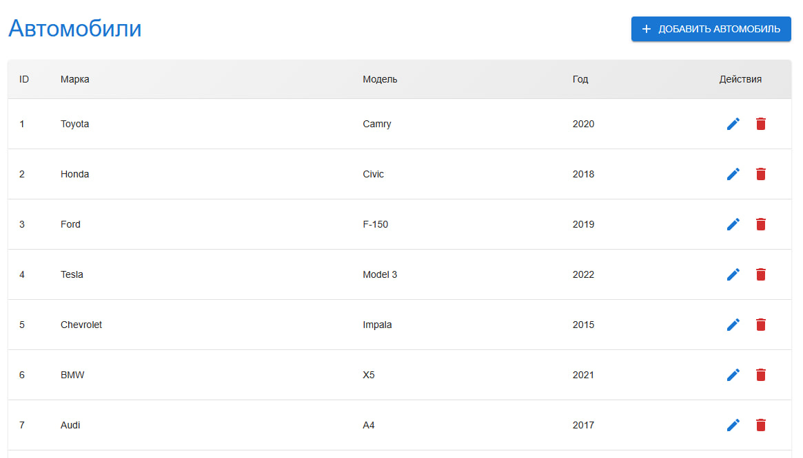
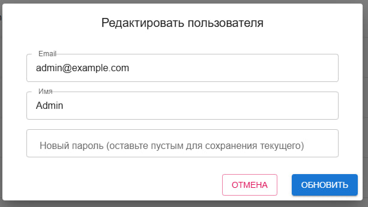
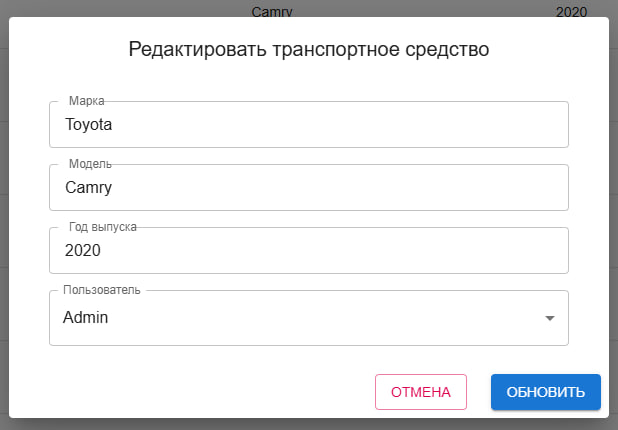
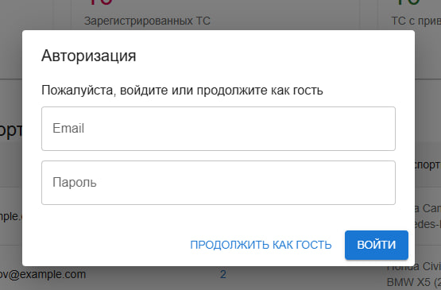
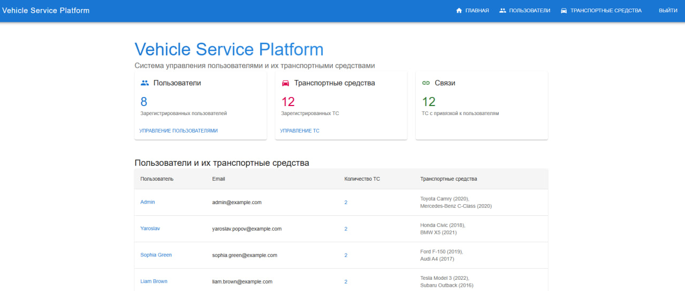
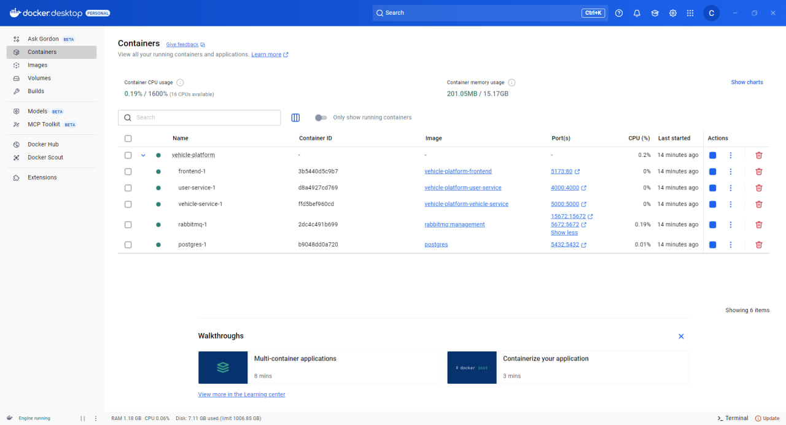

# Vehicle Service Platform 🚗🛠️

## Описание проекта

**Vehicle Service Platform** — микросервисное приложение для управления пользователями и их транспортными средствами.  
Сервис позволяет регистрировать пользователей и ТС, а также отправлять уведомления (например, о ТО или штрафах) между микросервисами через RabbitMQ.

---

## 📸 Скриншоты

### Список пользователей



### Список транспортных средств



### Форма пользователя



### Форма ТС



### Модальное окно авторизации



### Главная страница

## 

## Стек технологий

- **Frontend:** React + TypeScript
- **Backend:**
  - User Service: Node.js + Express + PostgreSQL
  - Vehicle Service: Node.js + Express + PostgreSQL
- **Месседжинг:** RabbitMQ
- **Контейнеризация:** Docker + docker-compose (опционально)
- **Тестирование API:** Postman

---

## Использование контейнеров



- **User Service:**

  - CRUD для пользователей
  - При создании пользователя отправляет событие в RabbitMQ

- **Vehicle Service:**
  - CRUD для транспортных средств
  - Обрабатывает события USER_CREATED из RabbitMQ, создавая пустую запись ТС
  - Ассоциирует ТС с пользователем по user_id

---

## Функциональные требования

### User Service API

| Метод  | Маршрут    | Описание                    |
| ------ | ---------- | --------------------------- |
| POST   | /users     | Создать пользователя        |
| GET    | /users     | Получить всех пользователей |
| GET    | /users/:id | Получить пользователя по ID |
| PUT    | /users/:id | Обновить пользователя       |
| DELETE | /users/:id | Удалить пользователя        |

### Vehicle Service API

| Метод  | Маршрут       | Описание                 |
| ------ | ------------- | ------------------------ |
| POST   | /vehicles     | Создать транспорт        |
| GET    | /vehicles     | Получить все транспорты  |
| GET    | /vehicles/:id | Получить транспорт по ID |
| PUT    | /vehicles/:id | Обновить транспорт       |
| DELETE | /vehicles/:id | Удалить транспорт        |

**Событие при создании пользователя:**

```json
{
  "type": "USER_CREATED",
  "data": {
    "id": 1,
    "email": "john@example.com"
  }
}
```

### User Service API

| Метод  | Маршрут    | Описание                    |
| ------ | ---------- | --------------------------- |
| POST   | /users     | Создать пользователя        |
| GET    | /users     | Получить всех пользователей |
| GET    | /users/:id | Получить пользователя по ID |
| PUT    | /users/:id | Обновить пользователя       |
| DELETE | /users/:id | Удалить пользователя        |

---

## Тестирование API с помощью Postman

Для удобного тестирования всех микросервисов проекта рекомендуется использовать [Postman](https://www.postman.com/).

В нашем репозитории доступна готовая коллекция запросов и файл окружения, которые помогут быстро начать работу с API.

### Как использовать коллекцию и окружение Postman

1. **Скачайте коллекцию с запросами:**  
   [VehiclePlatform.postman_collection.json](./docs/architecture/VehiclePlatform.postman_collection.json)

2. **Скачайте файл окружения:**  
   [VehiclePlatform.postman_environment.json](./docs/architecture/VehiclePlatform.postman_environment.json)

3. **Импортируйте файлы в Postman:**

   - В Postman нажмите **Import** → выберите скачанные файлы.
   - Активируйте импортированное окружение через выпадающий список в правом верхнем углу.

4. **Настройте переменные окружения, если необходимо:**  
   Например, URL сервисов (User Service, Vehicle Service) по умолчанию уже заданы, но при локальном запуске их можно изменить.

5. **Начинайте тестировать API:**  
   Все основные эндпоинты (создание пользователя, транспортного средства, получение данных и т.д.) уже готовы к использованию.

---

## Запущенный фронтенд

Вы также можете воспользоваться готовым веб-интерфейсом по адресу:  
[http://13.50.16.12:5173/](http://13.50.16.12:5173/)

Здесь доступна визуальная работа с пользователями и транспортными средствами.

---

Если понадобятся помощь с Postman или настройкой окружения — обращайтесь!
